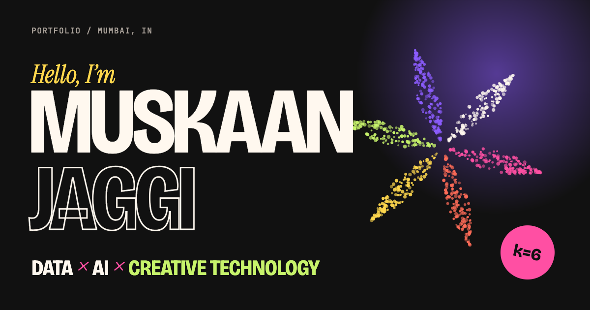

# Muskaan Jaggi — Portfolio

**Data × AI × Creative Technology.** This is the personal site of Muskaan Jaggi, a BTech Data Science student in Mumbai. It's built as an interactive project in its own right, with an editorial layout, a WebGL hero and a playground called the Lab.



## Highlights

- **Data Bloom hero.** About 7,000 particles in six clusters, drawn like a k-means scatter plot that turned into a flower. It's written with React Three Fiber and custom GLSL shaders, and it reacts to the cursor, to scrolling and to scroll speed. Phones get a lightweight SVG version instead.
- **Custom cursor** that changes with context (`VIEW ↗`, `OPEN`, `VISIT ↗`, `DRAG`). It's GSAP-driven, has a slight lag, and is turned off on touch devices.
- **Tactile UI.** Buttons use offset shadows, spring easing and a press state, and some of them are magnetic.
- **Scroll storytelling** with GSAP ScrollTrigger and Lenis: a pinned horizontal "build / think / create" sequence, a manifesto that lights up word by word, parallax, and ticker text whose speed follows the scroll.
- **The Lab**, a pin-board of objects you can drag around. It includes a small k-means clustering toy you can click to add points.
- **Case-study pages** for each project, with a sticky table of contents and an architecture diagram generated from data.
- **Page transitions**: a quick three-colour wipe between routes.
- A few **easter eggs**. Try clicking the big name, or the Konami code.

## Tech stack

| | |
|---|---|
| Framework | React 19 + Vite |
| Routing | React Router |
| 3D | Three.js, React Three Fiber, GLSL shaders (`src/shaders/`) |
| Motion | GSAP (ScrollTrigger, Draggable, `@gsap/react`), Lenis smooth scroll |
| Styling | Plain CSS with design tokens (`src/styles/tokens.css`) |
| Language | JavaScript |

## Getting started

Requires Node 18 or newer.

```bash
npm install      # install dependencies
npm run dev      # start the dev server at http://localhost:5173
npm run build    # production build into dist/
npm run preview  # serve the production build locally
```

## Project structure

```text
src/
├── data/            ← ALL CONTENT LIVES HERE (edit these, not the components)
│   ├── profile.js     name, intro, about, education, "three things", resume, photo
│   ├── projects.js    projects + case-study details
│   ├── experience.js  timeline
│   ├── skills.js      interactive skills cluster
│   ├── research.js    papers / publications
│   ├── lab.js         Lab pin-board objects
│   ├── creative.js    creative gallery
│   ├── social.js      email + social links
│   └── site.js        section on/off switches, nav, ticker text
├── sections/        homepage sections (Hero, About, Work, Lab, Skills, …)
├── pages/           routes: Home, ProjectDetail, LabPage, NotFound
├── components/      reusable UI (Navbar, CustomCursor, ProjectCard, Marquee, MagneticButton, …)
├── animations/      GSAP helpers: cursor, reveal, magnetic, parallax, pageTransition, smoothScroll
├── three/           WebGL scene + SVG fallback + shared point-cloud generator
├── shaders/         GLSL (vertex / fragment / noise)
├── hooks/           media-query, section animation and document-title hooks
└── styles/          tokens, base styles, tactile UI primitives
public/
├── resume/          your resume PDF
├── images/          project screenshots, creative work, portrait
├── og-image.png     social share preview (1200×630)
└── favicon.svg
```

## Customising your content

Every placeholder is written in `[SQUARE BRACKETS]` or starts with `YOUR_`. To list them all:

```bash
grep -rn "\[\|YOUR_" src/data
```

### Profile, about and contact
Edit `src/data/profile.js` and `src/data/social.js`. To hide a social link, set its `url` to `''`.

### Projects
Each project in `src/data/projects.js` is a plain object:

```js
{
  slug: 'my-project',            // used in the URL: /work/my-project
  placeholder: false,            // true shows a "REPLACE ME" sticker
  title: 'My Project',
  titleLines: ['My', 'Project'], // how the big title breaks across lines
  category: 'AI / ML',           // used by the index filter
  tags: ['AI', 'Education'],
  year: '2026',
  type: 'Team project',
  description: 'One or two sentences.',
  technologies: ['Python', 'React'],
  image: '/images/projects/my-project.webp', // '' draws a generative cover
  github: 'https://github.com/…',            // '' hides the button
  live: 'https://…',
  featured: true,                // featured projects get the big editorial card
  accent: 'pink',                // pink | coral | yellow | lime | purple
  cover: 'grid',                 // generative cover style if there's no image
  details: { role, team, problem, idea, howItWorks: [], contribution: [], result, architecture: [], gallery: [] },
}
```

You can add, remove or reorder projects without touching any components. Case-study pages are generated from `details`, and any section you leave empty is skipped. For screenshots, use `gallery: [{ src: '/images/projects/x-1.webp', alt: '…', caption: '…' }]`.

### Images
- Put images in `public/images/…` and reference them as `/images/…`.
- Use **WebP or AVIF** at about 1600px wide. For example: `npx @squoosh/cli --webp auto image.png`.
- Images are lazy-loaded automatically.

### Resume
Replace `public/resume/Muskaan_Jaggi_Resume.pdf` with your own file. If you use a different filename, update `resume` in `profile.js`.

### Portrait
Add `public/images/portrait.webp` and set `photo: '/images/portrait.webp'` in `profile.js`.

### Showing and hiding sections
In `src/data/site.js`, set any section in `sections` to `false`. For example, set `creative: false` until you have enough visual work. Section numbers such as "03 / 09" update automatically.

### Colours and fonts
Colours and fonts are defined in `src/styles/tokens.css`. Fonts are loaded in `index.html`.

## Deployment

### Vercel (recommended)
1. Push this folder to a GitHub repository.
2. On [vercel.com](https://vercel.com), choose **Add New → Project** and import the repo.
3. Vercel detects Vite automatically: the build command is `npm run build` and the output directory is `dist`. Click **Deploy**.

`vercel.json` already rewrites every route to `index.html`, so links like `/work/data-bloom` work on refresh.

### Netlify
Import the repo. `netlify.toml` already sets the build command, the publish folder and the SPA redirect.

### After your first deploy
Replace `https://YOUR-DOMAIN.vercel.app` in `index.html` with your real URL. This fixes the canonical link and social previews.

## Performance and accessibility

- Three.js is **code-split** and downloaded only on desktop devices that will render it. The WebGL loop pauses when the hero is off-screen, and GPU resources are released when you leave the page.
- **Reduced motion** is respected. There's no smooth scrolling, no reveal animations, and the hero is a static SVG.
- The custom cursor is purely decorative. Every link and control is a real `<a>` or `<button>`, with visible focus states and keyboard support. Dragging in the Lab is an extra on top of that, not the only way to use it.
- The markup is semantic: landmarks, one `h1` per page, alt text, and ARIA labels on split or animated text.

## Credits

Designed and built by Muskaan Jaggi. Simplex noise is by Ashima Arts and Stefan Gustavson (MIT). Fonts are Bricolage Grotesque, Manrope, Instrument Serif and JetBrains Mono, all from Google Fonts.
